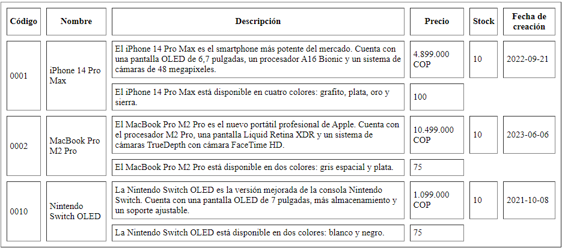

<!-- No borrar o modificar -->
[Inicio](./index.md)

## Sesión 4


<!-- Actividad 04 -->

# Actividad: Crear una tabla HTML con información sobre productos.
Escribir una tabla HTML con 10 filas que muestre información sobre productos reales. La tabla debe tener las siguientes columnas:

- Código
- Nombre
- Descripción
- Precio
- Stock
- Fecha de creación

Además, combinar celdas en la tabla con los atributos rowspan y colspan, como se muestra en la siguiente imagen.



## Solución
```html

<!DOCTYPE html>
<html lang="en">

<head>
    <meta charset="UTF-8">
    <meta name="viewport" content="width=device-width, initial-scale=1.0">
    <title>Tabla</title>
</head>

<body>

    <table border="3" cellpadding="5" cellspacing="5">
        <thead>

            <tr>
                <th>Codigo</th>
                <th>Nombre</th>
                <th>Descripción</th>
                <th>Precio</th>
                <th>Stock</th>
                <th>Fecha de creación</th>
            </tr>
        </thead>
        <tbody>
            <tr>
                <td rowspan="2">2556</td>
                <td rowspan="2">Vitamina B12</td>
                <td>La vitamina B12 es un nutriente que ayuda a mantener la salud de las neuronas y la sangre. Además,
                    contribuye a la formación del ácido desoxirribonucleico (ADN), el material genético presente en
                    todas las células.</td>
                <td>25.600 COP</td>
                <td>20</td>
                <td>05-01-2023</td>
            </tr>
            <tr>
                <td>Ayuda a prevenir la anemia megaloblástica, un trastorno de la sangre que causa cansancio y
                    debilidad.</td>
                <td>60</td>
            </tr>

            <tr>
                <td rowspan="2">3456</td>
                <td rowspan="2">Probioticos</td>
                <td>Los probióticos son alimentos o suplementos que contienen microorganismos vivos destinados a
                    mantener o mejorar las bacterias "buenas" (microbiota normal) del cuerpo.</td>
                <td>50.000 COP</td>
                <td>48</td>
                <td>22-05-2022</td>
            </tr>
            <tr>
                <td>Los probióticos han mostrado ser útiles en la prevención y tratamiento de las infecciones
                    intestinales, diarrea secundaria al uso de antibióticos y enfermedad inflamatoria intestinal.</td>
                <td>99</td>
            </tr>

            <tr>
                <td rowspan="2">2450</td>
                <td rowspan="2">Omega 3</td>
                <td>Los ácidos grasos omega-3 son un tipo de grasa poliinsaturada. Necesitamos estas grasas para
                    fortalecer las neuronas y para otras funciones importantes.</td>
                <td>70.800 COP</td>
                <td>30</td>
                <td>30-08-2022</td>
            </tr>
            <tr>
                <td>Reducen los triglicéridos, un tipo de grasa en la sangre. Reducen el riesgo de desarrollar latidos
                    cardíacos irregulares (arritmias).</td>
                <td>100</td>
            </tr>

            <tr>
                <td rowspan="2">2233</td>
                <td rowspan="2">Vitamina C</td>
                <td>La vitamina C es una vitamina hidrosoluble. Es necesaria para el crecimiento y desarrollo normales.
                    Las vitaminas hidrosolubles se disuelven en agua.</td>
                <td>60.000 COP</td>
                <td>5</td>
                <td>25-12-2022</td>
            </tr>
            <tr>
                <td>El ácido ascórbico también se usa para prevenir y tratar el escorbuto (una enfermedad que causa
                    fatiga, inflamación de las encías, dolor en las articulaciones y mala cicatrización de las heridas
                    debido a la falta de vitamina C en el cuerpo).</td>
                <td>60</td>

            <tr>
                <td rowspan="2">3345</td>
                <td rowspan="2">Vinagre de Manzana</td>
                <td>El vinagre de manzana sirve para ayudar en el tratamiento del acné, proteger contra enfermedades
                    cardiovasculares y prevenir el envejecimiento precoz.</td>
                <td>15.300 COP</td>
                <td>68</td>
                <td>12-03-2023</td>
            </tr>
            <tr>
                <td>Se ha utilizado tradicionalmente para la limpieza y la desinfección, el tratamiento del hongo de las
                    uñas, los piojos, las verrugas y las infecciones del oído.</td>
                <td>1</td>
            </tr>

            <tr>
                <td rowspan="2">5550</td>
                <td rowspan="2">Gelatina sin Sabor</td>
                <td>La gelatina sin sabor es un producto incoloro, traslúcido e insípido que se obtiene a partir del
                    colágeno procedente del tejido conectivo de animales.</td>
                <td>28.800 COP</td>
                <td>10</td>
                <td>22-05-2022</td>
            </tr>
            <tr>
                <td>Combate el exceso de sebo y grasa. Ayuda a mantener la piel limpia. Combate el envejecimiento
                    cutáneo y retrasa la presencia de signos de la edad en el cutis.</td>
                <td>2</td>
            </tr>

            <tr>
                <td rowspan="2">4590</td>
                <td rowspan="2">Zinc</td>
                <td>El zinc está presente en las células de todo el cuerpo. Ayuda al sistema inmunitario a luchar contra
                    las bacterias y los virus que lo atacan</td>
                <td>43.000 COP</td>
                <td>120</td>
                <td>10-06-2023</td>
            </tr>
            <tr>
                <td>El cuerpo también usa el zinc para producir ADN (el material genético de las células) y las
                    proteínas.</td>
                <td>90</td>
            </tr>

            <tr>
                <td rowspan="2">1299</td>
                <td rowspan="2">Biotina</td>
                <td>La biotina es una vitamina B que se encuentra en muchos alimentos y ayuda a convertir los
                    carbohidratos, las grasas y las proteínas que consume en energía que usted necesita.</td>
                <td>25.500 COP</td>
                <td>30</td>
                <td>24-02-2023</td>
            </tr>
            <tr>
                <td>La biotina se usa para la deficiencia de biotina. También se usa comúnmente para la caída del
                    cabello, las uñas quebradizas y otras afecciones</td>
                <td>40</td>
            </tr>

            <tr>
                <td rowspan="2">6870</td>
                <td rowspan="2">Magnesio</td>
                <td>El magnesio es un mineral indispensable para la nutrición humana. La mayor parte del magnesio en la
                    dieta proviene de los vegetales, como las verduras de hoja verde oscura.</td>
                <td>59.900 COP</td>
                <td>50</td>
                <td>12-07-2023</td>
            </tr>
            <tr>
                <td>Regula la función de los músculos y el sistema nervioso, los niveles de azúcar en la sangre, y la
                    presión sanguínea. Además, ayuda a formar proteína, masa ósea y ADN</td>
                <td>80</td>
            </tr>

            <tr>
                <td rowspan="2">3760</td>
                <td rowspan="2">Colageno</td>
                <td>El colágeno es uno de los materiales que forman el cartílago, los huesos y la piel.</td>
                <td>25.000 COP</td>
                <td>12</td>
                <td>22-10-2022</td>
            </tr>
            <tr>
                <td>Es un componente importante de tu piel. Juega un papel importante en el fortalecimiento de la piel,
                    y además puede beneficiar la elasticidad y la hidratación. </td>
                <td>90</td>
            </tr>
        </table>


        </body>
    </html>
```


